# Gestione e Distribuzione delle Chiavi Crittografiche
## Gestione delle Chiavi Crittografiche
- L'uso sicuro degli algoritmi di chiave crittografica dipende dalla protezione delle chiavi crittografiche.
- La gestione delle chiavi crittografiche è il processo di amministrazione o gestione delle chiavi crittografiche per un sistema crittografico.
  - Comporta la generazione, creazione, protezione, archiviazione, scambio, sostituzione e utilizzo delle chiavi e consente restrizioni selettive per determinate chiavi.
- Oltre alla restrizione di accesso, la gestione delle chiavi implica anche il monitoraggio e la registrazione dell'accesso, dell'uso e del contesto di ciascuna chiave.
- Un sistema di gestione delle chiavi includerà anche server di chiavi, procedure per gli utenti e protocolli.
- La sicurezza del sistema crittografico dipende dalla gestione efficace delle chiavi.

## Tecnica di Distribuzione delle Chiavi

- Il termine si riferisce ai mezzi per consegnare una chiave a due parti che desiderano scambiare dati senza consentire ad altri di vedere la chiave.
- Affinché la crittografia simmetrica funzioni, le due parti coinvolte nello scambio devono condividere la stessa chiave, e quella chiave deve essere protetta dall'accesso di terzi.
- Cambi frequenti delle chiavi sono auspicabili per limitare la quantità di dati compromessi se un attaccante riesce a scoprire la chiave.

## Distribuzione della Chiave Simmetrica

- Date le parti A e B, la distribuzione della chiave può essere realizzata in diversi modi:
  - A può selezionare una chiave e consegnarla fisicamente a B.
  - Una terza parte può selezionare la chiave e consegnarla fisicamente sia ad A che a B.
  - Se A e B hanno precedentemente e recentemente utilizzato una chiave, una delle parti può trasmettere la nuova chiave all'altra, cifrata utilizzando la vecchia chiave.
  - Se A e B hanno ciascuno una connessione crittografata con una terza parte C, C può consegnare una chiave sui collegamenti crittografati a A e B.
### Distribuzione delle chiavi tra due entità comunincanti
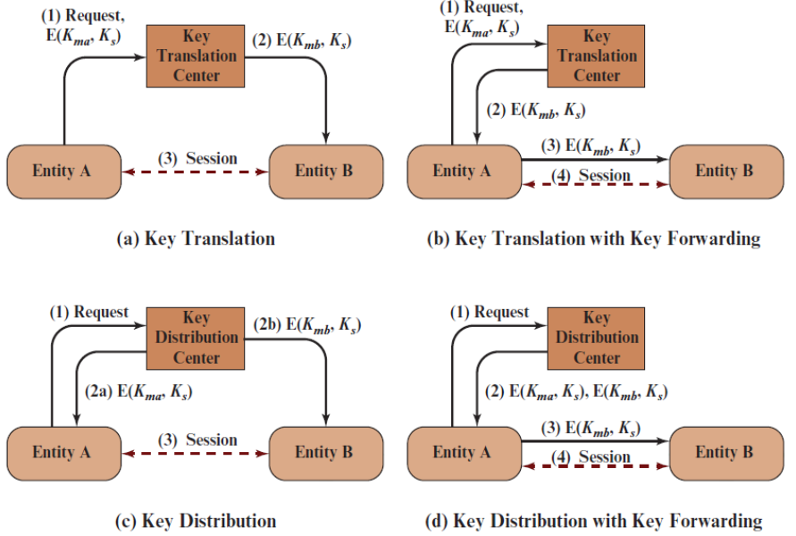
# 15.1 Distribuzione della Chiave Simmetrica Utilizzando la Crittografia Simmetrica

Questa sezione esamina le tecniche per distribuire chiavi segrete utilizzando solo tecniche di crittografia simmetrica.

## Opzioni di Distribuzione della Chiave

Affinché la crittografia simmetrica funzioni, le due parti coinvolte in uno scambio devono condividere la stessa chiave, e quella chiave deve essere protetta dall'accesso di terzi. Inoltre, cambi frequenti delle chiavi sono solitamente auspicabili per limitare la quantità di dati compromessi se un attaccante riesce a scoprire la chiave. Pertanto, la forza di qualsiasi sistema crittografico dipende dalla tecnica di distribuzione delle chiavi, un termine che si riferisce ai mezzi per consegnare una chiave a due parti che desiderano scambiare dati, senza consentire ad altri di vedere la chiave. Per due parti A e B, la distribuzione della chiave può essere realizzata in diversi modi, come segue:

1. A può selezionare una chiave e consegnarla fisicamente a B.
2. Una terza parte può selezionare la chiave e consegnarla fisicamente sia ad A che a B.
3. Se A e B hanno precedentemente e recentemente utilizzato una chiave, una delle parti può trasmettere la nuova chiave all'altra, cifrata utilizzando la vecchia chiave.
4. Se A e B hanno ciascuno una connessione crittografata con una terza parte C, C può consegnare una chiave sui collegamenti crittografati a A e B.

Le opzioni 1 e 2 richiedono la consegna manuale di una chiave. Per la crittografia dei collegamenti, questo è un requisito ragionevole, poiché ogni dispositivo di crittografia dei collegamenti scambierà dati solo con il suo partner all'altro capo del collegamento. Tuttavia, per la crittografia end-to-end su una rete, la consegna manuale è scomoda. In un sistema distribuito, qualsiasi utente o server può dover partecipare a scambi con molti altri utenti e server nel tempo. Pertanto, ogni endpoint ha bisogno di un numero di chiavi fornite dinamicamente. Il problema è particolarmente difficile in un sistema distribuito su vasta area.

La scala del problema dipende dal numero di coppie comunicanti che devono essere supportate. Se la crittografia end-to-end viene eseguita a livello di rete o IP, allora è necessaria una chiave per ogni coppia di host sulla rete che desidera comunicare. Pertanto, se ci sono $n$ host, il numero di chiavi richieste è:

$$\frac{n(n - 1)}{2}$$

Se la crittografia viene eseguita a livello di applicazione, allora è necessaria una chiave per ogni coppia di utenti o processi che richiedono comunicazione. Pertanto, una rete può avere centinaia di host ma migliaia di utenti e processi. Una rete che utilizza la crittografia a livello di nodo con 1000 nodi potrebbe concepibilmente dover distribuire fino a mezzo milione di chiavi. Se quella stessa rete supporta 10.000 applicazioni, allora potrebbero essere necessarie fino a 50 milioni di chiavi per la crittografia a livello di applicazione.

Tornando alla nostra lista, l'opzione 3 è una possibilità sia per la crittografia dei collegamenti che per la crittografia end-to-end, ma se un attaccante riesce mai a ottenere l'accesso a una chiave, tutte le chiavi successive saranno rivelate. Inoltre, la distribuzione iniziale di potenzialmente milioni di chiavi deve ancora essere effettuata.

Per la crittografia end-to-end, una qualche variazione dell'opzione 4 è stata ampiamente adottata. In questo schema, un centro di distribuzione delle chiavi è responsabile della distribuzione delle chiavi a coppie di utenti (host, processi, applicazioni) secondo necessità. Ogni utente deve condividere una chiave unica con il centro di distribuzione delle chiavi per scopi di distribuzione delle chiavi.
## Opzioni di Distribuzione Chiavi di Terze Parti

La Figura 15.1 illustra due diverse opzioni, ciascuna con due variazioni, per la distribuzione delle chiavi. I numeri lungo le linee rappresentano i passaggi dello scambio. In questi esempi, esiste una connessione tra le entità A e B, che desiderano scambiare informazioni utilizzando tecniche crittografiche. A questo scopo, necessitano di una chiave di sessione temporanea che durerà per la durata di una connessione logica, come una connessione TCP. A e B condividono ciascuno una chiave master di lunga durata con una terza parte coinvolta nella fornitura della chiave di sessione. Per questa discussione, la chiave di sessione è etichettata come Ks e le chiavi master tra le entità A e B e la terza parte sono etichettate come Kma e Kmb, rispettivamente.
Un centro di traduzione chiavi (KTC) trasferisce chiavi simmetriche per future comunicazioni tra due entità, almeno una delle quali ha la capacità di generare o acquisire chiavi simmetriche autonomamente. L'entità A genera o acquisisce una chiave simmetrica da utilizzare come chiave di sessione per la comunicazione con B. A cripta la chiave utilizzando la chiave master che condivide con il KTC e invia la chiave criptata al KTC. Il KTC decripta la chiave di sessione, la cripta nuovamente con la chiave master che condivide con B e invia quella chiave di sessione criptata nuovamente ad A (Figura 15.1a) affinché A la inoltri a B, oppure la invia direttamente a B (Figura 15.1b).

Un centro di distribuzione chiavi (KDC) genera e distribuisce chiavi di sessione. L'entità A invia una richiesta al KDC per una chiave simmetrica da utilizzare come chiave di sessione per la comunicazione con B. Il KDC genera una chiave di sessione simmetrica, quindi la cripta con la chiave master che condivide con A e la invia ad A. Il KDC cripta anche la chiave di sessione con la chiave master che condivide con B e la invia a B (Figura 15.1c). In alternativa, invia entrambi i valori di chiave criptati ad A, e A inoltra la chiave di sessione criptata con la chiave master condivisa dal KDC e B a B (Figura 15.1d).

La discussione precedente omette un certo numero di dettagli. Ad esempio, le parti che scambiano chiavi devono autenticarsi reciprocamente. I timestamp sono spesso utilizzati per limitare il tempo in cui può avvenire uno scambio di chiavi e/o la durata di vita di una chiave scambiata. Il Capitolo 16 esamina diversi approcci dettagliati allo scambio di chiavi simmetriche di terze parti nel contesto di Kerberos.
## Gerarchia delle Chiavi

Un requisito comune in una varietà di protocolli, come IEEE 802.11i e IPsec, discussi nella Parte Sei, è la crittografia di una chiave simmetrica in modo che possa essere distribuita a due parti per future comunicazioni. Spesso, un protocollo richiede una gerarchia di chiavi, con chiavi più basse nella gerarchia utilizzate più frequentemente e cambiate più spesso per contrastare gli attacchi (Figura 15.2). Una chiave di livello superiore, che viene utilizzata raramente e quindi è più resistente alla crittanalisi, viene utilizzata per crittografare una chiave di livello inferiore appena creata in modo che possa essere scambiata tra le parti che condividono la chiave di livello superiore. Il termine chiave effimera nella Figura 15.2 si riferisce a una chiave che viene utilizzata solo una volta o al massimo ha una vita molto breve.
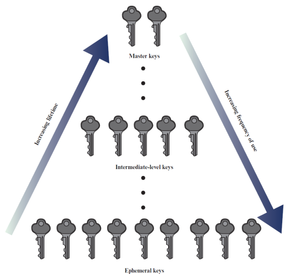
## 15.2 Distribuzione delle Chiavi Simmetriche

### Utilizzo della Crittografia Asimmetrica

A causa dell'inefficienza dei sistemi crittografici a chiave pubblica, essi sono quasi mai utilizzati per la crittografia diretta di blocchi di dati di grandi dimensioni, ma sono limitati a blocchi relativamente piccoli. Uno degli usi più importanti di un sistema crittografico a chiave pubblica è quello di crittografare chiavi segrete per la distribuzione. Vediamo molti esempi specifici di questo nella Parte Cinque. Qui, discutiamo principi generali e approcci tipici.

### Distribuzione Semplice delle Chiavi Segrete

Uno schema estremamente semplice è stato proposto da Merkle [MERK79], come illustrato nella Figura 15.3. Se A desidera comunicare con B, viene impiegata la seguente procedura:

1. A genera una coppia di chiavi pubblica/privata {PUA, PRA} e trasmette a B un messaggio contenente PUA e un identificatore di A, IDA.
2. B genera una chiave segreta, Ks, e la trasmette a A, che è criptata con la chiave pubblica di A.
3. A calcola D(PRA, E(PUA, Ks)) per recuperare la chiave segreta. Poiché solo A può decriptare il messaggio, solo A e B conosceranno l'identità di Ks.
4. A scarta PUA e PRA e B scarta PUB.
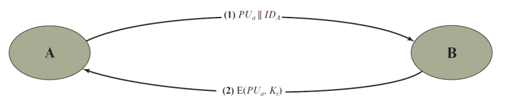

A e B possono ora comunicare in modo sicuro utilizzando la crittografia convenzionale e la chiave di sessione Ks. Al termine dello scambio, sia A che B scartano Ks. Nonostante la sua semplicità, questo è un protocollo attraente. Non esistono chiavi prima dell'inizio della comunicazione e nessuna esiste dopo il completamento della comunicazione. Pertanto, il rischio di compromissione delle chiavi è minimo. Allo stesso tempo, la comunicazione è sicura da intercettazioni.

Il protocollo rappresentato nella Figura 15.3 è insicuro contro un avversario che può intercettare i messaggi e può sia inoltrare il messaggio intercettato sia sostituirlo con un altro messaggio (vedi Figura 1.3c). Tale attacco è noto come [attacco man-in-the-middle](https://it.wikipedia.org/wiki/Attacco_man_in_the_middle). Abbiamo visto questo tipo di attacco nel Capitolo 10 (Figura 10.2). Nel caso attuale, se un avversario, D, ha il controllo del canale di comunicazione intermedio, allora D può compromettere la comunicazione nel seguente modo senza essere rilevato (Figura 15.4).

1. A genera una coppia di chiavi pubblica/privata {PUA, PRA} e trasmette un messaggio destinato a B contenente PUA e un identificatore di A, IDA.
2. D intercetta il messaggio, crea la propria coppia di chiavi pubblica/privata {PUD, PRD} e trasmette PUD ∥ IDA a B.
3. B genera una chiave segreta, Ks, e trasmette E(PUD, Ks).
4. D intercetta il messaggio e apprende Ks calcolando D(PRD, E(PUD, Ks)).
5. D trasmette E(PUA, Ks) ad A.

Il risultato è che sia A che B conoscono Ks e non sono a conoscenza del fatto che Ks è stato rivelato anche a D. A e B possono ora scambiarsi messaggi utilizzando Ks. D non interferisce più attivamente con il canale di comunicazione, ma semplicemente ascolta. Conoscendo Ks, D può decriptare tutti i messaggi, e sia A che B non sono a conoscenza del problema. Pertanto, questo semplice protocollo è utile solo in un ambiente in cui l'unica minaccia è l'intercettazione.

## Distribuzione della Chiave Segreta con Riservatezza e Autenticazione

La Figura 15.5, basata su un approccio suggerito in [NEED78], fornisce protezione contro attacchi sia attivi che passivi. Iniziamo da un punto in cui si assume che A e B abbiano scambiato chiavi pubbliche tramite uno degli schemi descritti successivamente in questo capitolo. Quindi si verificano i seguenti passaggi:

1. A utilizza la chiave pubblica di B per crittografare un messaggio a B contenente un identificatore di A (IDA) e un nonce (N1), che viene utilizzato per identificare univocamente questa transazione.
2. B invia un messaggio ad A crittografato con PUA e contenente il nonce di A (N1) così come un nuovo nonce generato da B (N2). Poiché solo B potrebbe aver decriptato il messaggio (1), la presenza di N1 nel messaggio (2) assicura ad A che il corrispondente è B.
3. A restituisce N2, crittografato utilizzando la chiave pubblica di B, per assicurare a B che il suo corrispondente è A.
4. A seleziona una chiave segreta KS e invia M = E(PUB, E(PRA, Ks)) a B. La crittografia di questo messaggio con la chiave pubblica di B assicura che solo B possa leggerlo; la crittografia con la chiave privata di A assicura che solo A possa averlo inviato (firma di A).
5. B calcola D(PUA, D(PRB, M)) per recuperare la chiave segreta.
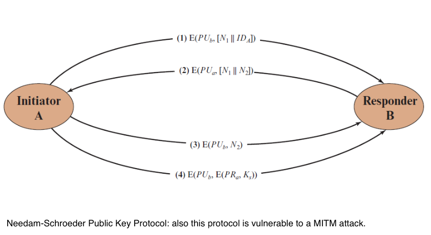

Il risultato è che questo schema garantisce sia la riservatezza che l'autenticazione nello scambio di una chiave segreta.

## 15.3 Distribuzione delle Chiavi Pubbliche

Sono state proposte diverse tecniche per la distribuzione delle chiavi pubbliche. Praticamente tutte queste proposte possono essere raggruppate nei seguenti schemi generali:

- Annuncio pubblico
- Directory pubblicamente disponibile
- Autorità delle chiavi pubbliche
- Certificati di chiave pubblica

### Annuncio Pubblico delle Chiavi Pubbliche

A prima vista, il punto della crittografia a chiave pubblica è che la chiave pubblica è pubblica. Pertanto, se esiste un algoritmo di chiave pubblica ampiamente accettato, come RSA, qualsiasi partecipante può inviare la propria chiave pubblica a qualsiasi altro partecipante o trasmettere la chiave alla comunità in generale (Figura 15.6).
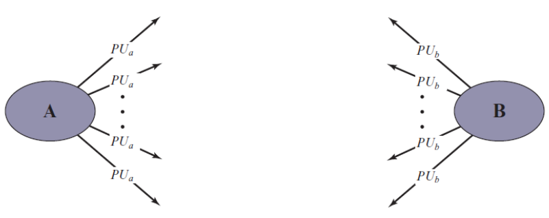

Sebbene questo approccio sia conveniente, presenta una grande debolezza. Chiunque può falsificare un tale annuncio pubblico. Cioè, un utente potrebbe fingersi l'utente A e inviare una chiave pubblica a un altro partecipante o trasmettere tale chiave pubblica. Fino a quando l'utente A non scopre la falsificazione e avvisa gli altri partecipanti, il falsario è in grado di leggere tutti i messaggi crittografati destinati ad A e può utilizzare le chiavi falsificate per l'autenticazione.

### Directory Pubblicamente Disponibile

Un maggiore grado di sicurezza può essere raggiunto mantenendo una directory dinamica di chiavi pubbliche pubblicamente disponibile. La manutenzione e la distribuzione della directory pubblica dovrebbero essere responsabilità di un'entità o organizzazione fidata (Figura 15.7). Tale schema includerebbe i seguenti elementi:

1. L'autorità mantiene una directory con un'entrata {nome, chiave pubblica} per ciascun partecipante.
2. Ogni partecipante registra una chiave pubblica presso l'autorità della directory. La registrazione dovrebbe avvenire di persona o tramite qualche forma di comunicazione sicura e autenticata.
3. Un partecipante può sostituire la chiave esistente con una nuova in qualsiasi momento, sia per il desiderio di sostituire una chiave pubblica che è già stata utilizzata per una grande quantità di dati, sia perché la chiave privata corrispondente è stata compromessa in qualche modo.
4. I partecipanti potrebbero anche accedere alla directory elettronicamente. A tal fine, è obbligatoria una comunicazione sicura e autenticata dall'autorità al partecipante.

Questo schema è chiaramente più sicuro rispetto agli annunci pubblici individuali, ma presenta ancora vulnerabilità. Se un avversario riesce a ottenere o calcolare la chiave privata dell'autorità della directory, l'avversario potrebbe distribuire in modo autoritativo chiavi pubbliche contraffatte e successivamente impersonare qualsiasi partecipante e intercettare i messaggi inviati a qualsiasi partecipante. Un altro modo per raggiungere lo stesso obiettivo è che l'avversario manometta i registri tenuti dall'autorità.
### Autorità delle Chiavi Pubbliche

Una sicurezza più forte per la distribuzione delle chiavi pubbliche può essere raggiunta fornendo un controllo più rigoroso sulla distribuzione delle chiavi pubbliche dalla directory. Uno scenario tipico è illustrato nella Figura 15.8, basato su una figura in [POPE79]. Come prima, lo scenario assume che un'autorità centrale mantenga una directory dinamica delle chiavi pubbliche di tutti i partecipanti. Inoltre, ogni partecipante conosce in modo affidabile una chiave pubblica per l'autorità, con solo l'autorità che conosce la corrispondente chiave privata. Si verificano i seguenti passaggi (corrispondenti per numero alla Figura 15.8):

- **1.**  A invia un messaggio con timestamp all'autorità delle chiavi pubbliche contenente una richiesta per la chiave pubblica attuale di B.
- **2.** L'autorità risponde con un messaggio che è crittografato utilizzando la chiave privata dell'autorità, PRauth. Pertanto, A è in grado di decriptare il messaggio utilizzando la chiave pubblica dell'autorità. Di conseguenza, A è assicurato che il messaggio provenga dall'autorità. Il messaggio include quanto segue:
   - La chiave pubblica di B, PUb, che A può utilizzare per crittografare i messaggi destinati a B.
   - La richiesta originale utilizzata per consentire ad A di abbinare questa risposta con la corrispondente richiesta precedente e per verificare che la richiesta originale non sia stata alterata prima della ricezione da parte dell'autorità.
   - Il timestamp originale fornito affinché A possa determinare che questo non è un messaggio vecchio dell'autorità contenente una chiave diversa dalla chiave pubblica attuale di B.
- **3.** A memorizza la chiave pubblica di B e la utilizza anche per crittografare un messaggio a B contenente un identificatore di A (IDA) e un nonce (N1), che viene utilizzato per identificare univocamente questa transazione.
- **4 e 5.** B recupera la chiave pubblica di A dall'autorità nello stesso modo in cui A ha recuperato la chiave pubblica di B.
A questo punto, le chiavi pubbliche sono state consegnate in modo sicuro ad A e B, e possono iniziare il loro scambio protetto. Tuttavia, sono desiderabili due ulteriori passaggi:

- **6.** B invia un messaggio ad A crittografato con PUa e contenente il nonce di A (N1) così come un nuovo nonce generato da B (N2). Poiché solo B potrebbe aver decriptato il messaggio (3), la presenza di N1 nel messaggio (6) assicura ad A che il corrispondente è B.
- **7.** A restituisce N2, crittografato utilizzando la chiave pubblica di B, per assicurare a B che il suo corrispondente è A.

Pertanto, sono richiesti un totale di sette messaggi. Tuttavia, i primi cinque messaggi devono essere utilizzati solo raramente, poiché sia A che B possono salvare la chiave pubblica dell'altro per un uso futuro—una tecnica nota come caching. Periodicamente, un utente dovrebbe richiedere copie fresche delle chiavi pubbliche dei suoi corrispondenti per garantire la loro attualità.
### Certificati di Chiave Pubblica

Lo scenario della Figura 15.8 è attraente, ma presenta alcuni svantaggi. L'autorità delle chiavi pubbliche potrebbe rappresentare un collo di bottiglia nel sistema, poiché un utente deve fare riferimento all'autorità per ottenere la chiave pubblica di ogni altro utente che desidera contattare. Come prima, la directory di nomi e chiavi pubbliche mantenuta dall'autorità è vulnerabile a manomissioni.

Un approccio alternativo, suggerito per la prima volta da Kohnfelder [KOHN78], è quello di utilizzare certificati che possono essere usati dai partecipanti per scambiare chiavi senza contattare un'autorità delle chiavi pubbliche, in un modo che è affidabile come se le chiavi fossero ottenute direttamente da un'autorità delle chiavi pubbliche. In sostanza, un certificato consiste in una chiave pubblica, un identificatore del proprietario della chiave e l'intero blocco firmato da una terza parte fidata. Tipicamente, la terza parte è un'autorità di certificazione, come un'agenzia governativa o un'istituzione finanziaria, che è fidata dalla comunità degli utenti. Un utente può presentare la propria chiave pubblica all'autorità in modo sicuro e ottenere un certificato. L'utente può quindi pubblicare il certificato. Chiunque necessiti della chiave pubblica di questo utente può ottenere il certificato e verificare che sia valido tramite la firma fidata allegata. Un partecipante può anche trasmettere le proprie informazioni sulla chiave a un altro trasmettendo il proprio certificato. Altri partecipanti possono verificare che il certificato sia stato creato dall'autorità.

Possiamo porre i seguenti requisiti su questo schema:

1. Qualsiasi partecipante può leggere un certificato per determinare il nome e la chiave pubblica del proprietario del certificato.
2. Qualsiasi partecipante può verificare che il certificato provenga dall'autorità di certificazione e non sia contraffatto.
3. Solo l'autorità di certificazione può creare e aggiornare i certificati.
Questi requisiti sono soddisfatti dalla proposta originale in [KOHN78]. Denning [DENN83] ha aggiunto il seguente requisito aggiuntivo:

4. Qualsiasi partecipante può verificare la validità temporale del certificato.

Uno schema di certificato è illustrato nella Figura 15.9. Ogni partecipante fa richiesta all'autorità di certificazione, fornendo una chiave pubblica e richiedendo un certificato. La richiesta deve avvenire di persona o tramite qualche forma di comunicazione sicura e autenticata. Per il partecipante A, l'autorità fornisce un certificato della forma:
$$ C_A = E(P{R_{auth}}, [T \parallel I{D_A} \parallel P{U_a}]) $$
dove PRauth è la chiave privata utilizzata dall'autorità e T è un timestamp. A può quindi trasmettere questo certificato a qualsiasi altro partecipante, che legge e verifica il certificato come segue:
$$ D(P{U_{auth}}, C_A) = D(P{U_{auth}}, E(P{R_{auth}}, [T \parallel I{D_A} \parallel P{U_a}])) = (T \parallel I{D_A} \parallel P{U_a}) $$
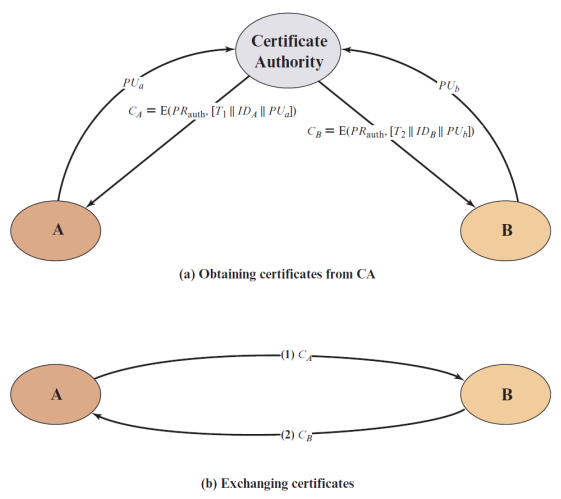

Il destinatario utilizza la chiave pubblica dell'autorità, PUauth, per decriptare il certificato. Poiché il certificato è leggibile solo utilizzando la chiave pubblica dell'autorità, questo verifica che il certificato provenga dall'autorità di certificazione. **Gli elementi IDA e PUA forniscono al destinatario il nome A e la chiave pubblica del titolare del certificato. Il timestamp T convalida l'attualità del certificato.** Il timestamp contrasta il seguente scenario: la chiave privata di A viene appresa da un avversario. A genera una nuova coppia di chiavi private/pubbliche e fa richiesta all'autorità di certificazione per un nuovo certificato. **Nel frattempo**, l'avversario riproduce il vecchio certificato a B. Se B crittografa i messaggi utilizzando la vecchia chiave pubblica compromessa, l'avversario può leggere quei messaggi.

In questo contesto, la compromissione di una chiave privata è paragonabile alla perdita di una carta di credito. Il proprietario annulla il numero della carta di credito ma è a rischio fino a quando tutti i possibili comunicanti non sono a conoscenza del fatto che la vecchia carta di credito è obsoleta. Pertanto, il timestamp funge da data di scadenza. Se un certificato è sufficientemente vecchio, si presume che sia scaduto.

Uno schema è diventato universalmente accettato per la formattazione dei certificati di chiave pubblica: lo standard X.509. I certificati X.509 sono utilizzati nella maggior parte delle applicazioni di sicurezza di rete, inclusi la sicurezza IP, la sicurezza del livello di trasporto (TLS) e S/MIME, tutti discussi nella Parte Sei. X.509 sarà esaminato in dettaglio nella sezione successiva.
## Certificati X.509
(ultima versione 9.1 del 2021)

[X.509](https://it.wikipedia.org/wiki/X.509)

- Parte della serie di raccomandazioni X.500 che definisce un servizio di directory
  - La directory è, di fatto, un server o un insieme distribuito di server che mantiene un database di informazioni sugli utenti.
  
- X.509 definisce un framework per la fornitura di servizi di autenticazione dalla directory X.500 ai suoi utenti
  - È stato inizialmente emesso nel 1988 con l'ultima revisione nel 2016.
  - Basato sull'uso della crittografia a chiave pubblica e delle firme digitali.
  - Non impone l'uso di un algoritmo specifico, ma raccomanda RSA.
  - Non impone un algoritmo di hash specifico.

- Ogni certificato contiene la chiave pubblica di un utente ed è firmato con la chiave privata di un'autorità di certificazione fidata.

- X.509 definisce protocolli di autenticazione alternativi basati sull'uso di certificati di chiave pubblica.

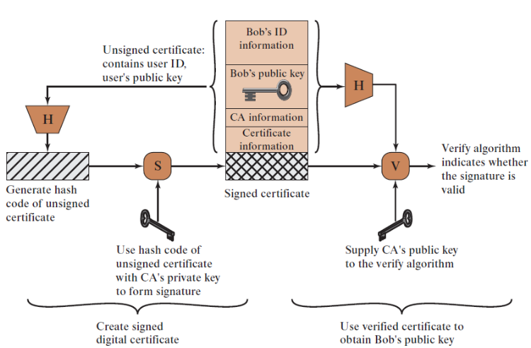

## Certificati

Creati da un'autorità di certificazione fidata (CA) e hanno i seguenti elementi:

- Versione
- Numero di serie
- Identificatore dell'algoritmo di firma
- Nome dell'emittente
- Periodo di validità
- Nome del soggetto
- Informazioni sulla chiave pubblica del soggetto
- Identificatore univoco dell'emittente
- Identificatore univoco del soggetto
- Estensioni
- Firma
## Elementi del Certificato
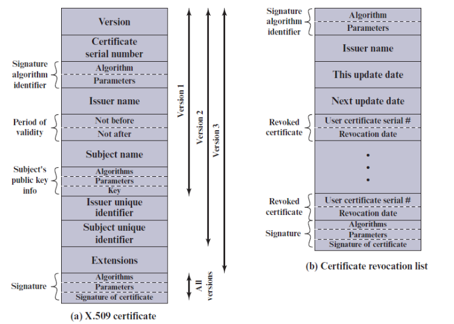

- **Versione**: Differenzia tra le versioni successive del formato del certificato; il valore predefinito è la versione 1. Se l'identificatore univoco dell'emittente o l'identificatore univoco del soggetto sono presenti, il valore deve essere la versione 2. Se sono presenti una o più estensioni, la versione deve essere la versione 3. Sebbene la specifica X.509 sia attualmente alla versione 7, non sono state apportate modifiche ai campi che compongono il certificato dalla versione 3.

- **Numero di serie**: Un valore intero unico all'interno della CA emittente che è inequivocabilmente associato a questo certificato.

- **Identificatore dell'algoritmo di firma**: L'algoritmo utilizzato per firmare il certificato insieme a eventuali parametri associati. Poiché queste informazioni sono ripetute nel campo della firma alla fine del certificato, questo campo ha poca, se non alcuna, utilità.

- **Nome dell'emittente**: Nome X.500 della CA che ha creato e firmato questo certificato.

- **Periodo di validità**: Consiste in due date: la prima e l'ultima in cui il certificato è valido.

- **Nome del soggetto**: Il nome dell'utente a cui si riferisce questo certificato. Cioè, questo certificato certifica la chiave pubblica del soggetto che detiene la corrispondente chiave privata.

- **Informazioni sulla chiave pubblica del soggetto**: La chiave pubblica del soggetto, più un identificatore dell'algoritmo per il quale questa chiave deve essere utilizzata, insieme a eventuali parametri associati.

- **Identificatore univoco dell'emittente**: Un campo di stringa di bit opzionale utilizzato per identificare univocamente la CA emittente nel caso in cui il nome X.500 sia stato riutilizzato per entità diverse.

- **Identificatore univoco del soggetto**: Un campo di stringa di bit opzionale utilizzato per identificare univocamente il soggetto nel caso in cui il nome X.500 sia stato riutilizzato per entità diverse.

- **Estensioni**: Un insieme di uno o più campi di estensione. Le estensioni sono state aggiunte nella versione 3 e saranno discusse più avanti in questa sezione.

- **Firma**: Copre tutti gli altri campi del certificato. Un componente di questo campo è la firma digitale applicata agli altri campi del certificato. Questo campo include l'identificatore dell'algoritmo di firma.
I campi identificatori univoci sono stati aggiunti nella versione 2 per gestire il possibile riutilizzo dei nomi dei soggetti e/o degli emittenti nel tempo. Questi campi sono raramente utilizzati.

Lo standard utilizza la seguente notazione per definire un certificato:

$$ \lbrace A \quad CA \ll A \gg = CA \{ V, SN, AI, CA, UCA, A, UA, A_p, T^A \rbrace $$

dove:

- $ Y \ll X \gg $ = il certificato dell'utente X emesso dall'autorità di certificazione Y
- $ Y \{ I \} $ = la firma di I da parte di Y. Consiste in I con un hash crittografato
- $ V $ = versione del certificato
- $ SN $ = numero di serie del certificato
- $ AI $ = identificatore dell'algoritmo utilizzato per firmare il certificato
- $ CA $ = nome dell'autorità di certificazione
- $ UCA $ = identificatore univoco opzionale della CA
- $ A $ = nome dell'utente A
- $ UA $ = identificatore univoco opzionale dell'utente A
- $ Ap $ = chiave pubblica dell'utente A
- $ T $ = periodo di validità del certificato

L'autorità di certificazione firma il certificato con la sua chiave privata. Se la corrispondente chiave pubblica è nota a un utente, allora quell'utente può verificare che un certificato firmato dalla CA sia valido. Questo è l'approccio tipico della firma digitale illustrato nella Figura 13.2.
## Ottenere un Certificato

- I certificati utente generati da una CA hanno le seguenti caratteristiche:
  - Qualsiasi utente con accesso alla chiave pubblica della CA può verificare la chiave pubblica dell'utente che è stata certificata.
  - Nessuna parte, tranne l'autorità di certificazione, può modificare il certificato senza che ciò venga rilevato.

- Poiché i certificati sono inalterabili, possono essere collocati in una directory senza la necessità che la directory faccia sforzi speciali per proteggerli.
  - Inoltre, un utente può trasmettere il proprio certificato direttamente ad altri utenti.

- Una volta che B è in possesso del certificato di A, B ha fiducia che i messaggi che crittografa con la chiave pubblica di A saranno sicuri da intercettazioni e che i messaggi firmati con la chiave privata di A sono inalterabili.
## Modelli di Fiducia

Diversi modelli di fiducia determinano come gli utenti stabiliranno la validità dei certificati:

- **Fiducia Diretta**
- **Fiducia Gerarchica**
- **Rete di Fiducia**
## Modelli di Fiducia: Fiducia Diretta
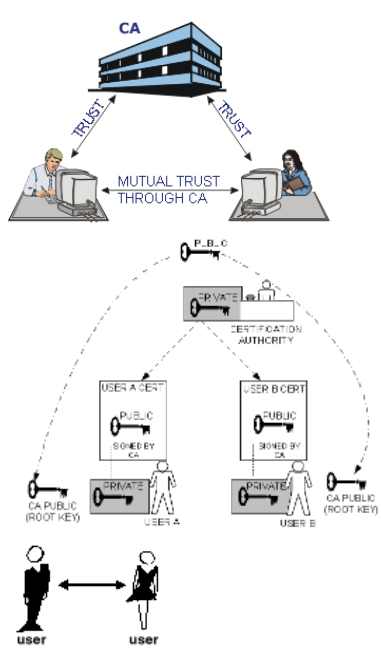

**Fiducia Diretta**: se tutti gli utenti si abbonano alla stessa CA, allora c'è una fiducia comune in quella CA. 

Tutti i certificati utente possono essere collocati nella stessa directory per l'accesso da parte di tutti gli utenti. Inoltre, la trasmissione dei certificati da utente a utente (come in PGP) è possibile.
## Modelli di Fiducia: Fiducia Gerarchica
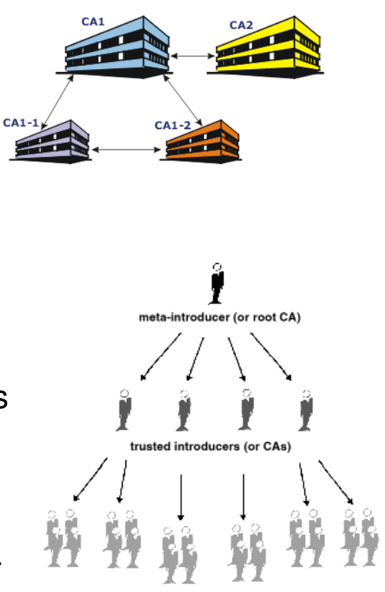

**Fiducia Gerarchica**: per una grande comunità di utenti, è più pratico avere un numero di CA, ciascuna delle quali fornisce in modo sicuro la propria chiave pubblica a una frazione degli utenti.

### Albero di Fiducia:
La fiducia si estende da un certo numero di certificati radice. 

Questi certificati possono certificare certificati stessi, oppure possono certificare certificati che certificano ancora altri certificati lungo una certa catena. 

La validità del certificato foglia è verificata tracciando all'indietro dal suo certificatore, ad altri certificatori, fino a quando non si trova un certificato radice direttamente fidato.
## Fiducia Gerarchica e Cross-Certificazione
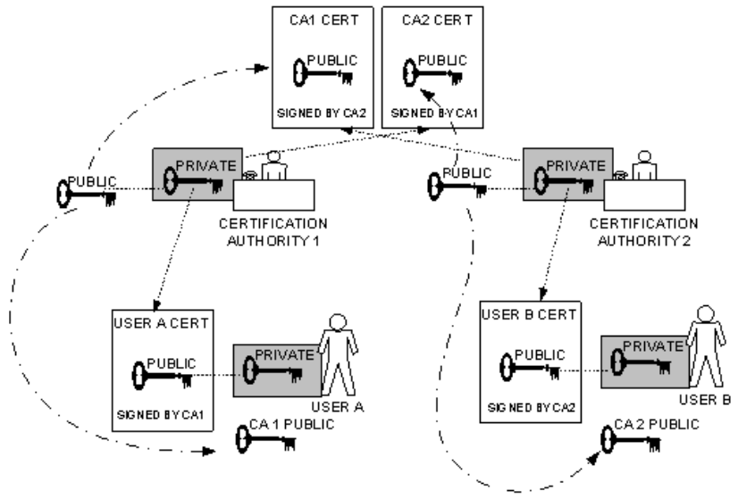

Supponiamo che A e B abbiano ottenuto certificati dalle CA X1 e X2, rispettivamente. 

Se A non conosce in modo sicuro la chiave pubblica di X2, allora A non può convalidare il certificato di B.

**Cross-Certificazione**: se le CA hanno scambiato le proprie chiavi pubbliche, allora A può ottenere la chiave pubblica di B tramite una catena di certificati. 

A ottiene, dalla directory, il certificato di X2 firmato da X1. 

A può così ottenere la chiave pubblica di X2 (e verificarla tramite la firma di X1 sul certificato). 

A poi torna alla directory e ottiene il certificato di B firmato da X2, che A può ora verificare con la copia fidata della chiave pubblica di X2.
## Fiducia Gerarchica e Cross-Certificazione: X.509
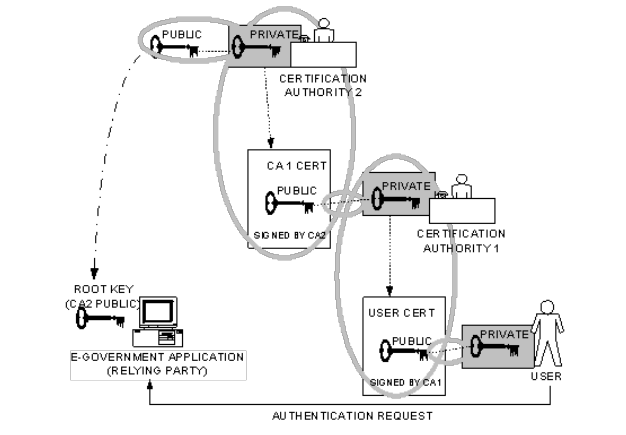

In X.509, questa catena di certificati è espressa come:

$ X_1 \ll X_2 \gg X_2 \ll B \gg $

B ottiene la chiave pubblica di A con la catena inversa:

$ X_2 \ll X_1\gg X_1  \ll A \gg $

Una catena con $n$ elementi è:

$ X_1 \ll X_2 \gg X_2 \ll X_3 \gg \ldots  X_n  \ll B \gg $

dove ogni coppia $ (X_i, X_{i+1}) $ di CA nella catena ha creato certificati l'uno per l'altro (memorizzati nella directory).
## Gerarchia X.509
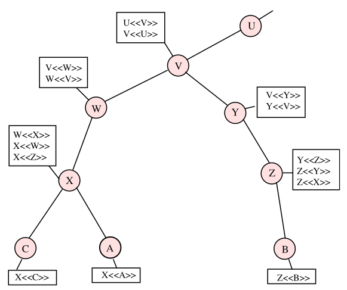

X.509 suggerisce che le CA siano disposte in una gerarchia. 

Cerchi connessi indicano la relazione gerarchica tra le CA. 

Scatole associate indicano i certificati mantenuti nella directory per ciascun ingresso della CA.

- **Certificati in avanti**: certificati di X generati da altre CA.
- **Certificati inversi**: certificati di altre CA generati da X.
#### Certificati per Stabilire un Percorso di Connessione

L'Utente A può acquisire i seguenti certificati dalla directory per stabilire un percorso di connessione verso B: $ X \ll W \gg W \ll V \gg V \ll Y \gg Y \ll Z \gg Z \ll B\gg $ e dopodiché può decomprimere per ottenere una copia fidata della chiave pubblica di B. Allo stesso modo, B può ottenere la chiave pubblica di A da: $ Z \ll Y \gg Y \ll V \gg V \ll W \gg W \ll X \gg X \ll A \gg$.

## Revoca dei Certificati

- **Ogni certificato include un periodo di validità**
  - Tipicamente, un nuovo certificato viene emesso poco prima della scadenza del vecchio.
  
- **Può essere desiderabile, in alcune occasioni, revocare un certificato prima della scadenza, per uno dei seguenti motivi:**
  - La chiave privata dell'utente si presume compromessa.
  - L'utente non è più certificato da questa CA.
  - Il certificato della CA si presume compromesso.

- **Ogni CA deve mantenere un elenco composto da tutti i certificati revocati ma non scaduti emessi da quella CA.**
  - Questi elenchi dovrebbero essere pubblicati nella directory.

## X.509 Versione 3

- **Il formato della versione 2 non trasmette tutte le informazioni che l'esperienza recente di progettazione e implementazione ha dimostrato essere necessarie.**
  
- **Invece di continuare ad aggiungere campi a un formato fisso, gli sviluppatori di standard hanno ritenuto necessario un approccio più flessibile.**
  - La versione 3 include un numero di estensioni opzionali.

- **Le estensioni del certificato rientrano in tre categorie principali:**
  - Informazioni su chiavi e politiche.
  - Attributi del soggetto e dell'emittente.
  - Vincoli sul percorso di certificazione.

**Ogni estensione consiste di:**
- Un identificatore dell'estensione.
- Un indicatore di criticità.
- Un valore dell'estensione.
## Informazioni su Chiavi e Politiche

- **Queste estensioni trasmettono informazioni aggiuntive sulle chiavi del soggetto e dell'emittente, oltre a indicatori della politica del certificato.**
  
- **Una politica del certificato è un insieme di regole nominate che indica l'applicabilità di un certificato a una particolare comunità e/o classe di applicazione con requisiti di sicurezza comuni.**

- **Sono inclusi:**
  - Identificatore della chiave dell'autorità.
  - Identificatore della chiave del soggetto.
  - Utilizzo della chiave (firma digitale, ripudio, crittografia della chiave, ecc.).
  - Periodo di utilizzo della chiave privata.
  - Politiche del certificato.
  - Mappature delle politiche (consentono a una CA di indicare altre CA equivalenti).
## Attributi del Soggetto e dell'Emittente del Certificato

- **Queste estensioni supportano nomi alternativi, in formati alternativi, per un soggetto del certificato o un emittente del certificato.**
  
- **Possono trasmettere informazioni aggiuntive sul soggetto del certificato per aumentare la fiducia dell'utente del certificato che il soggetto sia una persona o entità particolare.**

- **I campi di estensione in quest'area includono:**
  - Nome alternativo del soggetto.
  - Nome alternativo dell'emittente.
  - Attributi della directory del soggetto.
## Vincoli sul Percorso di Certificazione

- **Queste estensioni consentono di includere specifiche di vincolo nei certificati emessi per le CA da altre CA.**
  
- **I vincoli possono limitare i tipi di certificati che possono essere emessi dalla CA soggetto o che possono verificarsi successivamente in una catena di certificazione.**

- **I campi di estensione in quest'area includono:**
  - Vincoli di base (se il soggetto può agire come una CA).
  - Vincoli di nome.
  - Vincoli di politica (ad esempio, identificazione esplicita della politica del certificato).
# Scenario PKI
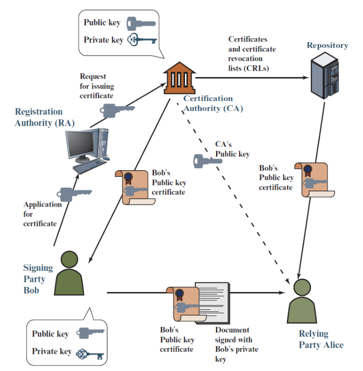

## Interazione dei Vari Componenti

La Figura 15.13 illustra l'interazione dei vari componenti. Considera una parte affidabile, Alice, che ha bisogno di utilizzare la chiave pubblica di Bob. Alice deve prima ottenere in modo affidabile e sicuro una copia della chiave pubblica della CA. Questo può essere fatto in diversi modi e dipende dall'architettura PKI particolare e dalla politica aziendale.

Se Alice desidera inviare dati crittografati a Bob, controlla con il Repository per determinare se il certificato di Bob è stato revocato e, se non lo è, ottiene una copia del certificato di Bob. Alice può quindi utilizzare la chiave pubblica di Bob per crittografare i dati inviati a Bob. Bob può anche inviare un documento ad Alice firmato con la chiave privata di Bob. Bob può includere il suo certificato con il documento o presumere che Alice abbia già o possa ottenere il certificato. In entrambi i casi, Alice utilizza prima la chiave pubblica della CA per verificare che il certificato sia valido, quindi utilizza la chiave pubblica di Bob (ottenuta dal certificato) per convalidare la firma di Bob.

Piuttosto che una singola CA, un'azienda potrebbe dover fare affidamento su più CA e più repository. Le CA possono essere organizzate in modo gerarchico, con una CA radice che è ampiamente fidata e firma il certificato della chiave pubblica delle CA subordinate. Molti certificati radice sono incorporati nei browser Web, quindi hanno una fiducia integrata in quelle CA. I server Web, i client di posta elettronica, gli smartphone e molti altri tipi di hardware e software supportano anche la PKI e contengono certificati radice fidati delle principali CA.

## Modelli di Fiducia: Rete di Fiducia

La rete di fiducia comprende fiducia diretta e gerarchica, aggiungendo l'idea che la fiducia è negli occhi di chi guarda (che è la visione del mondo reale) e che più informazioni sono migliori. Un certificato è considerato fidato direttamente, o fidato in qualche catena che risale a un certificato radice fidato direttamente (il meta-introduttore), o da un gruppo di introduttori.

## Rete di Fiducia: PGP

[Come funziona PGP](https://it.wikipedia.org/wiki/Pretty_Good_Privacy#Come_funziona_PGP)

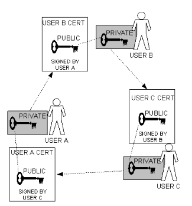

PGP utilizza un'infrastruttura di gestione delle chiavi basata su certificati per le chiavi pubbliche degli utenti. I certificati PGP (e la gestione delle chiavi) differiscono dai certificati X.509 in diversi modi importanti, ad esempio:

- Una chiave PGP può avere più firme (anche "auto-firma").
- Ogni utente crea e firma certificati per le persone che conosce (pertanto, non è necessaria un'infrastruttura centrale).
- Una nozione di "fiducia" è incorporata in ogni firma, e le firme per una singola chiave possono avere diversi livelli di fiducia (e gli utenti di un certificato agiscono in base al livello di fiducia).

- In un ambiente PGP, qualsiasi utente può agire come un'autorità di certificazione. 
  - Le firme digitali come forma di introduzione: quando un utente firma la chiave di un altro, diventa un introduttore di quella chiave.
  - Man mano che questo processo continua, si stabilisce una rete di fiducia.

- Qualsiasi utente PGP può convalidare il certificato della chiave pubblica di un altro utente, ma tale certificato è valido per un altro utente solo se riconosce il validatore come un introduttore fidato. 

  - Cioè, tu ti fidi della mia opinione sulla validità delle chiavi degli altri solo se mi consideri un introduttore fidato.
  -  Altrimenti, la mia opinione sulla validità delle altre chiavi è irrilevante.
## Sistema di Reputazione in PGP

- Memorizzati nel keyring pubblico di ciascun utente ci sono indicatori che mostrano se
  - l'utente considera una particolare chiave valida
  - il livello di fiducia che l'utente ripone nella chiave, in quanto il proprietario della chiave può fungere da certificatore delle chiavi di altri.

- Indichi, sulla tua copia della mia chiave, se pensi che il mio giudizio conti. È davvero un sistema di reputazione: alcune persone sono reputate dare buone firme, e le persone si fidano di loro per attestare la validità delle altre chiavi.
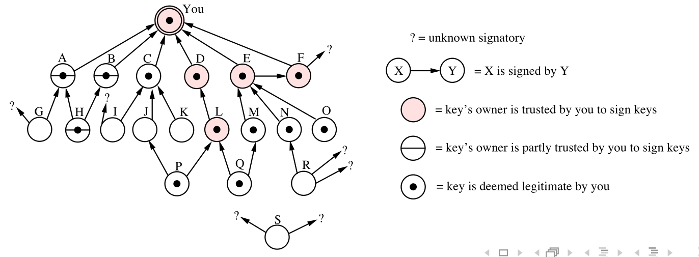

## Esempio PGP

Alice vuole comunicare con Bob. Ottiene il certificato della chiave pubblica PGP di Bob, ad esempio: 

**Ellen, Fred, Giselle $\ll$ Bob $\gg$**

Alice non conosce nessuno dei firmatari, quindi da un server di certificati ottiene il certificato PGP di Giselle:

**Henry, Irene, Giselle $\ll$ Giselle $\gg$**

Conosce vagamente Henry, quindi per verificare il certificato di Giselle ottiene il certificato di Henry:

**Ellen, Henry $\ll$ Henry $\gg$**

Dunque abbiamo:

**Ellen, Fred, Giselle $\ll$ Bob $\gg$**  
**Henry, Irene, Giselle $\ll$ Giselle $\gg$**  
**Ellen, Henry $\ll$ Henry $\gg$**  

Alice nota che la firma di Henry è al livello di fiducia "casuale", quindi decide di cercare conferma altrove. Ottiene il certificato di Ellen:

**Jack, Ellen $\ll$ Ellen $\gg$**  

Riconosce immediatamente Jack come suo cugino e, poiché ha il certificato di Jack, lo utilizza per convalidare il certificato di Ellen: nota che la sua firma è al livello di fiducia "positivo", e quindi accetta il certificato di Ellen come valido e lo utilizza per convalidare quello di Bob. 

Nota che anche Ellen ha firmato il certificato con fiducia "positiva", quindi conclude che il certificato, e la chiave pubblica che contiene, sono affidabili.

Alice ha seguito due catene di firme:  
**Henry $\ll$ Henry $\gg$ Henry $\ll$ Giselle $\gg$ Giselle $\ll$ Bob $\gg$**  
**Jack $\ll$ Ellen $\gg$ Ellen $\ll$ Bob $\gg$**  
(dove le firme non verificate sono state omesse).

I livelli di fiducia hanno influenzato il modo in cui Alice ha controllato il certificato.

## Distinzione tra Certificati X.509 e PGP

I certificati X.509 includono un elemento di fiducia, ma la fiducia non è indicata nel certificato.  
I certificati PGP indicano il livello di fiducia, ma lo stesso livello di fiducia può avere significati diversi per diversi firmatari (cfr. anche "risoluzione dei nomi").
